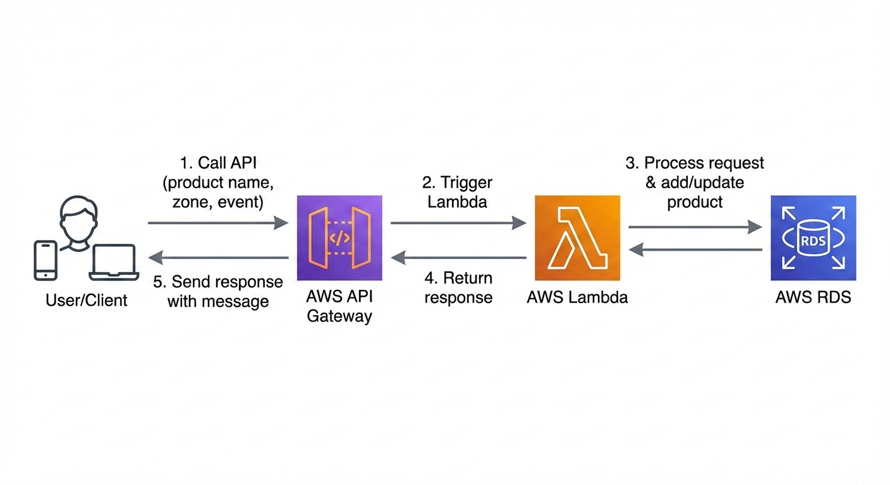

# Aethreallegence-backend
Backend services and API's for the application

## Disclaimer
All code, configs, and models produced for this application are owned by Aethreallegence Enterprise LLC under the engineer agreement, and cannot be used without written approval.

### AWS services 
- API Gateway
- Lambda Functions
- RDS MySQL Database

### MVP Scope
* Milestone 1
    - Backend infrastructure:
        - Create backend API to accept the form data and send the form data to lambda function
        - Create lambda function to process form data
        - Create database to store products and events data
    - Adding new product using text/voice:        
        - Ability to add new product to the database through a simple form that collects (product name, location, event type)        
        - lambda function will first search for product name in the database to check if it exists, if it doesn't exist, it will then create a new product record and create an event record for product addition
        - lambda function will send a response through API Gateway with sucess/failure message
    - Updating existing product location using text/voice:
        - If the lambda function found a product name already exists in the database, it will only create a new event record to update product location and event type
        - lambda function will send a response through API Gateway with sucess/failure message
    - Limitations
        - For the first MVP milestone, the application is only accessible through web browser, in next milestone we will deploy to a mobile app to be installed on apple/andriod mobile devices

* Architecture Diagram
  
* Technical Notes
    - Database credintials are stored in AWS Secret Manager
    - lambda functino uses environment varials to store database host/username/password
    - In the case of API failure, first indecation is when user receives a failure response from lambda 
    - If an error message is received, the first place to look to troubleshoot is the lambda logs in cloudwatch service. This will show the backend error message to help identify the issue.
    - If the error message is anything other than problem with user input, escalate to one of the engineers to investigate further.
    - lambda function code is deployed right from AWS lambda function service, the code is maintained in github then copied to the lambda code section on AWS.
    - frontend code will be in a separate github repo and will be deployed to web environment for first milestone.
