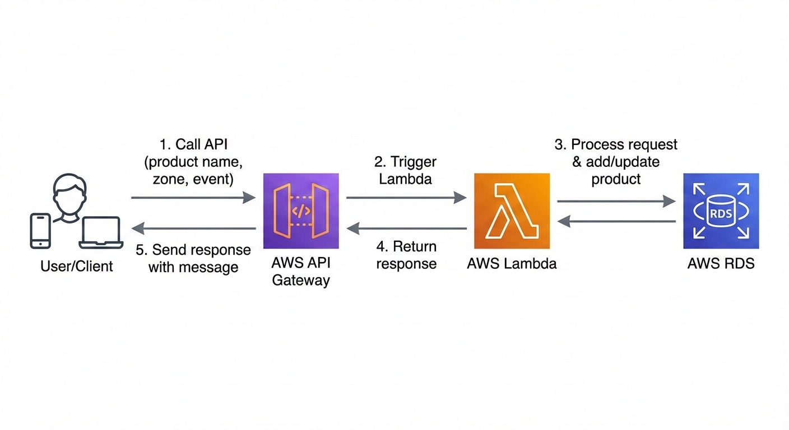

# Aethreallegence-backend

Backend services and API's for the application

## Disclaimer

All code, configs, and models produced for this application are owned by Aethreallegence Enterprise LLC under the engineer agreement, and cannot be used without written approval.

Aethreallegence System-Level Invention Overview (Patent Context)
This section describes the novel system behavior independent of implementation details.

### System Purpose

The Aethreallegence system is designed to maintain inventory truth in physical environments by
modeling inventory as a confidence-weighted state rather than as a continuously tracked set of
individual items.
The system addresses failures in traditional POS-, RFID-, and scan-based systems, which treat inventory records as authoritative until manual reconciliation occurs.

### Inventory State Ledger

The system maintains an inventory state ledger that represents inventory at the SKU and zone level, rather than at the individual item identity level.
Each ledger entry includes:
• SKU identifier
• Zone identifier
• Quantity estimate
• Associated confidence value
• Timestamp of last corroboration
Inventory records are treated as provisional beliefs, not authoritative truth.

### Event Processing vs State Truth

Backend services ingest events (e.g., product addition, movement, removal) via text, voice, or sensor inputs. Events do not directly overwrite inventory truth.
Instead, events are evaluated against the current inventory state and used to reinforce, contradict, or degrade confidence in that state. Stable inventory states require no continuous processing.

### Confidence Evaluation and Decay

Each inventory state entry includes a confidence value that:
• Increases when corroborating evidence is observed
• Decays over time when evidence is absent
• Drops sharply when contradictory evidence is detected
When confidence falls below a threshold, the system triggers exception workflows.

### Exception-Only Compute Model

Unlike systems that continuously track all items, Aethreallegence:
• Suppresses processing for high-confidence states
• Processes only anomalies and uncertainty
• Generates corrective actions only when needed
This allows the system to scale to thousands of SKUs without linear growth in compute or bandwidth.

### Correction and Learning Boundary

Corrective actions may include:
• Human confirmation
• Voice-based verification
• Targeted rescan or review
Only validated corrections are allowed to update machine learning models.
Raw observations never directly trigger learning.
This prevents model drift and preserves auditability.

### Implementation Independence

While the current MVP implementation uses:
• AWS Lambda
• API Gateway
• RDS databases
The claimed invention is implementation-agnostic and applies to any distributed computing environment capable of maintaining inventory state, confidence evaluation, and exception-driven correction.

### AWS services

- API Gateway
- Lambda Functions
- RDS MySQL Database

### MVP Scope

- Milestone 1
  - Backend infrastructure:
    - Create backend API to accept the form data and send the form data to lambda function
    - Create lambda function to process form data
    - Create database to store products and events data
  - Adding new product using text/voice:
    - Ability to add new product to the database through a simple form that collects (product name, location, event type)
    - lambda function will first search for product name in the database to check if it exists, if it doesn't exist, it will then create a new product record and create an event record for product addition
    - lambda function will send a response through API Gateway with sucess/failure message
  - Updating existing product location using text/voice:
    - If the lambda function found a product name already exists in the database, it will only create a new event record to update product location and event type
    - lambda function will send a response through API Gateway with sucess/failure message
  - Limitations
    - For the first MVP milestone, the application is only accessible through web browser, in next milestone we will deploy to a mobile app to be installed on apple/andriod mobile devices

- Architecture Diagram
  
- Technical Notes
  - Database credintials are stored in AWS Secret Manager
  - lambda functino uses environment varials to store database host/username/password
  - In the case of API failure, first indecation is when user receives a failure response from lambda
  - If an error message is received, the first place to look to troubleshoot is the lambda logs in cloudwatch service. This will show the backend error message to help identify the issue.
  - If the error message is anything other than problem with user input, escalate to one of the engineers to investigate further.
  - lambda function code is deployed right from AWS lambda function service, the code is maintained in github then copied to the lambda code section on AWS.
  - frontend code will be in a separate github repo and will be deployed to web environment for first milestone.
